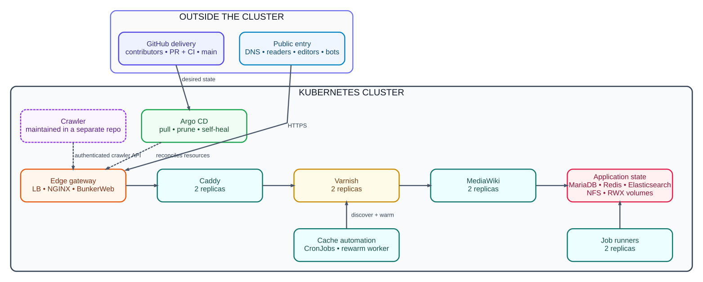

# WikiApiary Canasta Kubernetes

[](https://github.com/semantisch/wikiapiary-canasta-k8s/actions/workflows/validate.yaml)
[](https://github.com/semantisch/wikiapiary-canasta-k8s/actions/workflows/production.yaml)

GitOps source for WikiApiary on the production Kubernetes cluster.
The live Argo CD application reads this repository's `main` branch,
renders `charts/canasta` with `values/prod.yaml`, and reconciles namespace
`canasta-wikiapiary-live` with pruning and self-healing enabled.

## Architecture



[Graphviz diagram source](docs/architecture.dot)

Solid paths are live today. The purple dashed path marks the Crawler integration.
The Crawler runs in the same cluster, is maintained in a separate repository, and
reaches WikiApiary through an authenticated API boundary with no direct database
or storage access. Cache discovery, priority warming, and the rewarm worker are
part of this deployment and remain separate from the Crawler.

## Repository structure

```text
.
├── .github/                 contribution policy and CI/CD workflows
├── argocd/                  live Argo CD Application declaration
├── bootstrap/               secret shapes and cluster bootstrap examples
├── charts/canasta/
│   ├── files/               MediaWiki, Caddy, Varnish, and helper configuration
│   ├── templates/           Kubernetes workload and service templates
│   └── values.yaml          chart defaults and value documentation
├── docs/
│   ├── architecture.dot     editable architecture-diagram source
│   ├── architecture.svg     rendered diagram embedded above
│   └── hostname/README.md   canonical-host migration runbook
├── image/                   legacy image build support
├── legacy/                  retained WikiApiary assets and source material
├── scripts/                 policy, cache, cutover, and smoke validations
├── values/prod.yaml         reviewed production values and site identity
├── CONTRIBUTING.md          complete contributor policy
└── SECURITY.md              private vulnerability-reporting process
```

The chart is vendored so pull requests can render and validate the complete
deployment without downloading mutable chart code. Production-specific values
remain separate from chart defaults, and runtime secrets are referenced by name
rather than stored in Git.

## Contributing

Contributions from forks are welcome; cluster access is not required.

1. Fork the repository and create a focused branch from `main`.
2. Make one coherent change. Add or update validation when behavior changes, and
   never commit tokens, kubeconfigs, passwords, database dumps, or live secrets.
3. Run the commands in [Local validation](#local-validation).
4. Open a pull request and complete its checklist. CI renders the production
   release, enforces GitOps policy, and exercises cache-warming behavior.
5. Address review feedback and keep required checks green. A maintainer merge to
   protected `main` is the production release; Argo CD then reconciles it.

Read [CONTRIBUTING.md](CONTRIBUTING.md) for the full policy and
[SECURITY.md](SECURITY.md) for private vulnerability reporting.

## CI/CD flow

1. A contributor opens a pull request from any fork.
2. `Validate / Helm and policy` lints the chart, renders production manifests,
   rejects duplicate YAML keys or unsafe GitOps drift, exercises the cache
   warmer, and simulates a `wikiapiary.com` hostname cutover.
3. Protected `main` accepts only reviewed, validated pull requests.
4. Argo CD detects the merge and automatically reconciles the live namespace.
5. The `Production / Observe GitOps deployment` job waits for the repo-configured
   canonical hostname, MediaWiki identity, and homepage cache HIT.

GitHub Actions has no kubeconfig, Argo CD token, or production secret. Argo CD
pulls from GitHub, which keeps workflows from untrusted forks isolated from the
cluster. Runtime secrets remain in Kubernetes and are referenced by name.

## Wiki APIs

The deployed canonical API origin follows `site.primaryHost` in
`values/prod.yaml`. These links use the retained API hostname
`wikiapiary.dobriy.ai`, which remains routed and certificate-covered after the
canonical cutover:

- [MediaWiki Action API](https://wikiapiary.dobriy.ai/w/api.php) — query, edit,
  login, token, and extension modules.
- [API sandbox](https://wikiapiary.dobriy.ai/wiki/Special:ApiSandbox) — build and
  test Action API requests interactively.
- [Site information example](https://wikiapiary.dobriy.ai/w/api.php?action=query&meta=siteinfo&format=json) —
  machine-readable canonical site identity and capabilities.
- [Semantic query API example](https://wikiapiary.dobriy.ai/w/api.php?action=ask&query=%5B%5BCategory%3AWebsite%5D%5D%7Climit%3D1&format=json) —
  Semantic MediaWiki data through the Action API.

Write operations require an authenticated MediaWiki account and the appropriate
token; do not place credentials in this repository. Integrations should derive
their origin from the canonical hostname rather than depending on an alias.

## Hostname configuration

`site.primaryHost` in `values/prod.yaml` is the canonical source of truth for
MediaWiki, Caddy, ingress routing, edge TLS, job runners, Semantic MediaWiki,
and cache warming. The primary host is automatically added to routing and the
edge certificate. `ingress.edge.tlsHosts` contains retained TLS aliases, which
also remain routed after a canonical-host change.

After DNS is pointed at the edge load balancer, the production cutover requires
changing only `site.primaryHost`. Follow the complete
[hostname-change runbook](docs/hostname/README.md) for the required DNS order,
validation, rollout, and one-line rollback.

## Local validation

Install Helm 3, Python 3, PHP 8.2 CLI, and the Python requirements, then run:

```bash
python3 -m pip install --requirement requirements-ci.txt
helm lint charts/canasta -f values/prod.yaml
helm template canasta-wikiapiary charts/canasta -f values/prod.yaml > /tmp/wikiapiary-rendered.yaml
python3 scripts/validate-gitops.py /tmp/wikiapiary-rendered.yaml
python3 scripts/validate-cache-warmer.py /tmp/wikiapiary-rendered.yaml
```

## Bootstrap and secrets

Argo CD, its repository credential, and live application secrets are bootstrapped
outside this public repository. Examples under `bootstrap/` contain names and
shapes only; never commit real credentials.

## Storage

Production runs multiple web, Caddy, Varnish, and job-runner replicas across the
worker nodes. Shared image, extension, skin, public-asset, and cache-warmer paths
use static RWX volumes backed by the in-cluster NFS workload. MariaDB,
Elasticsearch, and NFS backing storage are pinned to the designated data node.

## Upstream chart refresh

Use `scripts/vendor-canasta-chart.sh` to refresh the vendored Canasta chart from
a checked-out `Canasta-CLI` tree. Review the complete diff and run all validation
before opening a pull request.
