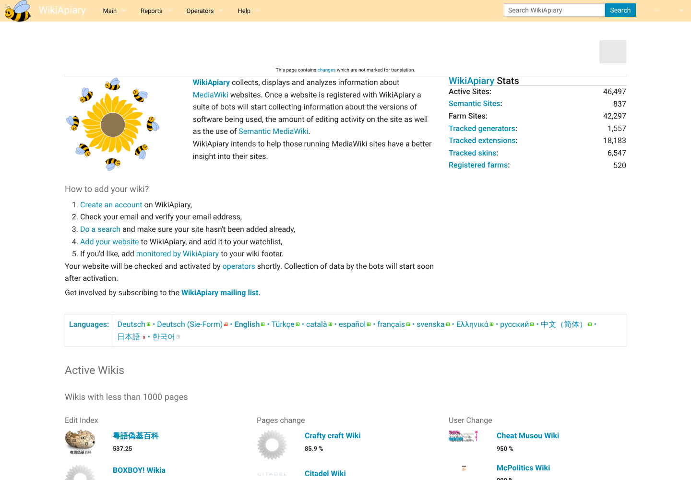
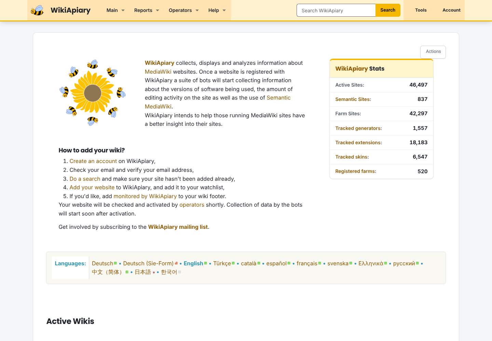
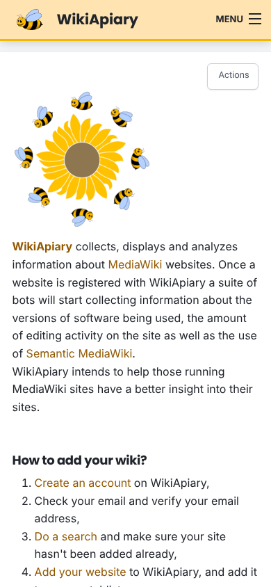

# Foreground modernization

WikiApiary continues to use the existing Foreground skin. The production chart
adds a small, WikiApiary-specific ResourceLoader module from
`charts/canasta/files/wikiapiary/` to modernize the presentation without
forking page content or requiring a different skin.

The enhancement keeps the bee artwork and honey-colored navigation while
improving navigation states, typography, spacing, tables, forms, focus styles,
and small-screen behavior. On the Main Page it also presents the statistics as
a compact card and suppresses the editor-only stale-translation notice.

## Main Page comparison

### Before

### After

### After on a small screen

## Maintenance

- Edit `charts/canasta/files/wikiapiary/wikiapiary-modern.css` for visual
  changes.
- Edit `charts/canasta/files/wikiapiary/wikiapiary-modern.js` only for small,
  progressive accessibility or navigation enhancements.
- Set `foregroundModern.enabled: false` to return to the unmodified Foreground
  presentation.
- Render and validate the production chart before submitting a pull request;
  CI enforces the asset mounts, ResourceLoader registration, syntax, responsive
  rules, focus treatment, and Main Page-specific fixes.
